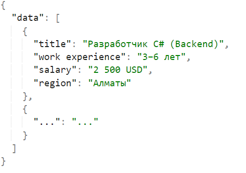

### Необходимо спарсить данные о вакансиях python разработчиков с сайта hh.ru, введя в поиск “python разработчик” и указав, что мы рассматриваем все регионы. 

Необходимо спарсить:
- Название вакансии
- Требуемый опыт работы
- Заработную плату
- Регион

Cохранить данные в формате json в следующем виде:
- 

### Путь решения

Создается впечатление, что задача поставлена не очень корректно.
При таком запросе в результаты попадает много не относящихся к "python разработке" вакансий.
Корректней бы было искать только по заголовку вакансии, но будем решать как поставлена задача.

В результате более 7000 вакансий, но HH "разрешает" посмотреть только первые 2000.
Разбиваем запрос на подзапросы:
- Только без опыта
- Только с опытом более 6 лет
- Опыт между 1 и 3 годами + не содержит слов "python","developer,"разработчик","программист" в заголовке вакансии
- Опыт между 1 и 3 годами + содержит слова "python","developer,"разработчик","программист" в заголовке вакансии
- Опыт между 3 и 6 годами + не содержит слов "python","developer,"разработчик","программист" в заголовке вакансии
- Опыт между 3 и 6 годами + содержит слова "python","developer,"разработчик","программист" в заголовке вакансии

Такой подход позволит извлечь почти все вакансии

Решаем с помощью Selenium Webdriver и Selene, обходя все страницы