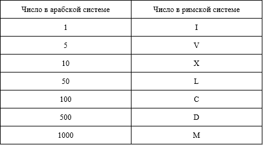

### Дано целое положительное число X, необходимо вывести вариант этого числа в римской системе счисления в формате строки.

- 

Римские числа записываются от наибольшего числа к наименьшему слева направо.

Однако число 4 не является “IIII”. Вместо этого число 4 записывается, как “IV”. Т.к. 1 стоит перед 5, мы вычитаем 1, делая 4. Тот же принцип применим к числу 9, которое записывается как “IX”.

Случаи, когда используется вычитание:

I может быть помещен перед V и X, чтобы сделать 4 и 9.

X может быть помещен перед L и C, чтобы составить 40 и 90.

C может быть помещен перед D и M, чтобы составить 400 и 900.